# A web based application (Created using Winforms Framework and MySql)
  
 

# Purpose
  - The purpose of this application is to create a Mobile Application and Web Application for Sales, Inventory, and Ordering 
    of BGC Seedlings Supply Company
  - Design and implement a mobile and web-based e-commerce application
  
 
  
# Features
  - User Management System 
    - Create new user  
    - Update user information
    - Delete user 
  - Notification System 
    - View all records of performance, events, and transactions 
  - Login Form
  - Reports 
  - Inventory System 
    - Create new product
    - Update certain product
    - Delete product 
  - Sales System 
    - Generate a sale
    - Delete sale 
    - View transaction records 
    - Display of company’s total revenue
  - Orders 
    - View orders from customers  
    - Change the status of orders from pending to finished or from pending to canceled and vice-versa 
  
# Screenshots
<table>
  <tr>
   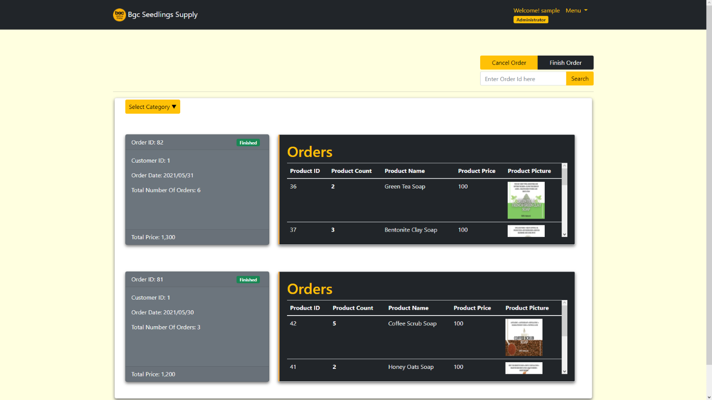
   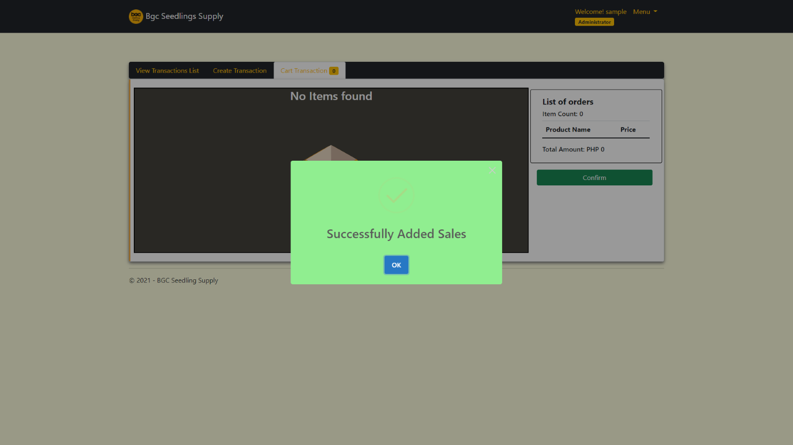   
   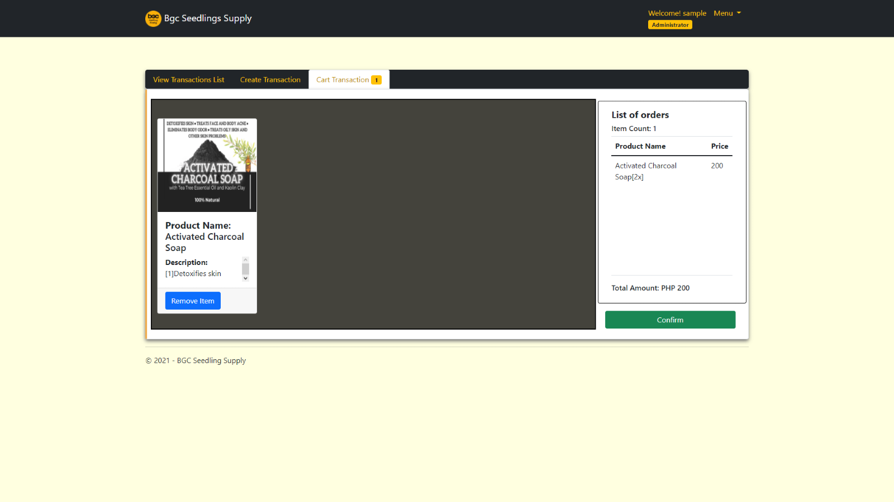  
 </tr>
 <tr>
   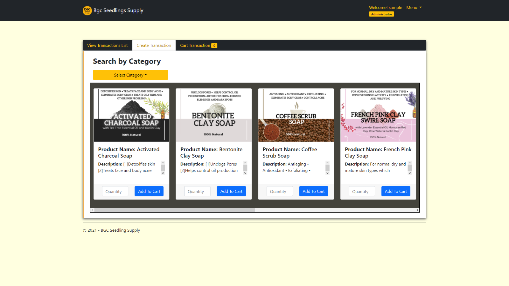
   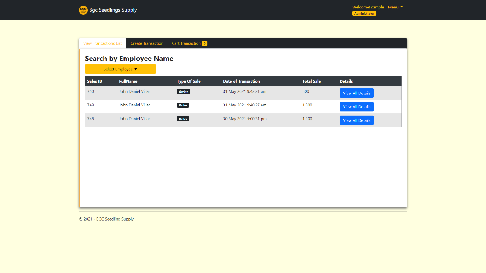
   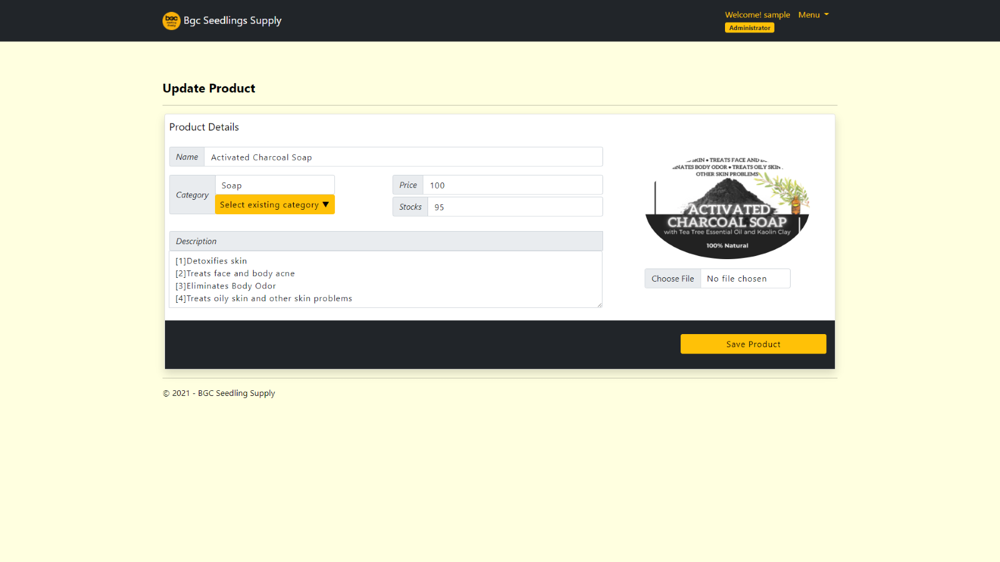   
 </tr>
  <tr>
   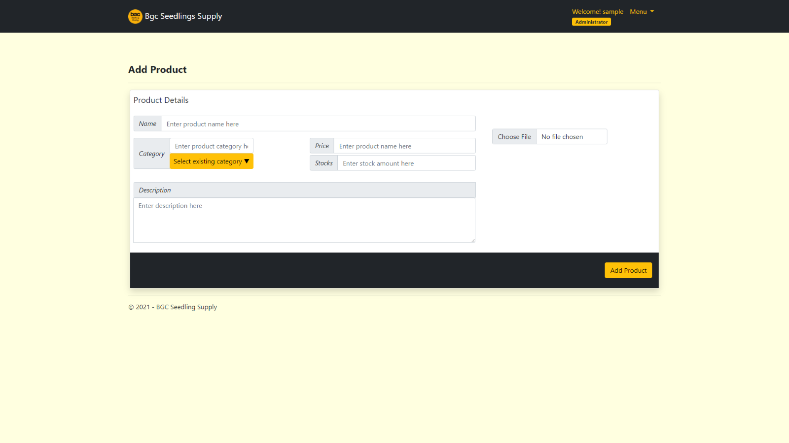
   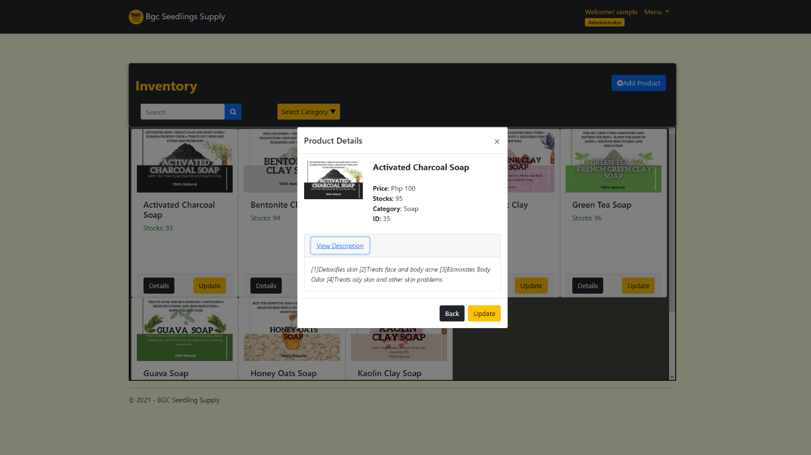
   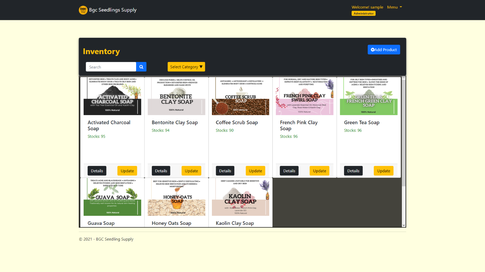   
 </tr>
   <tr>
   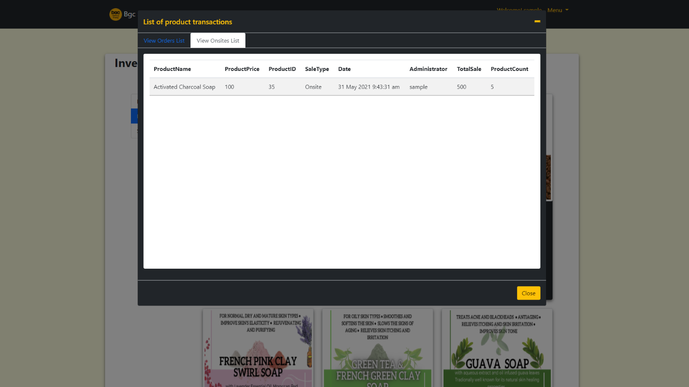
   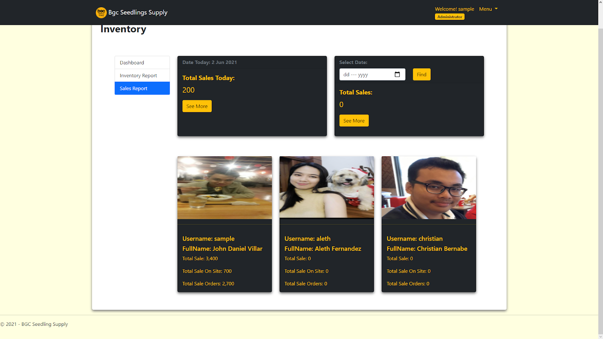
   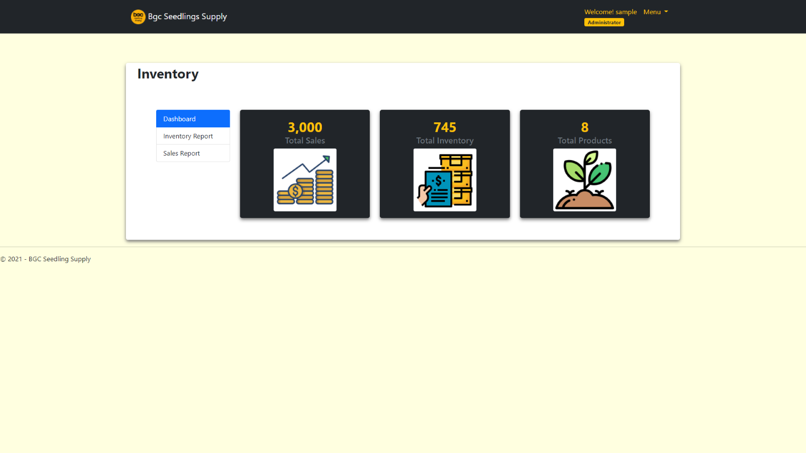   
 </tr>
   <tr>
   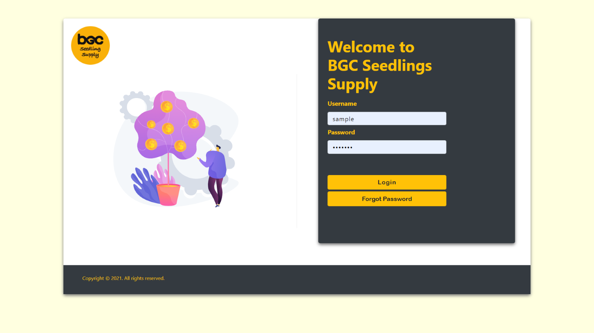
   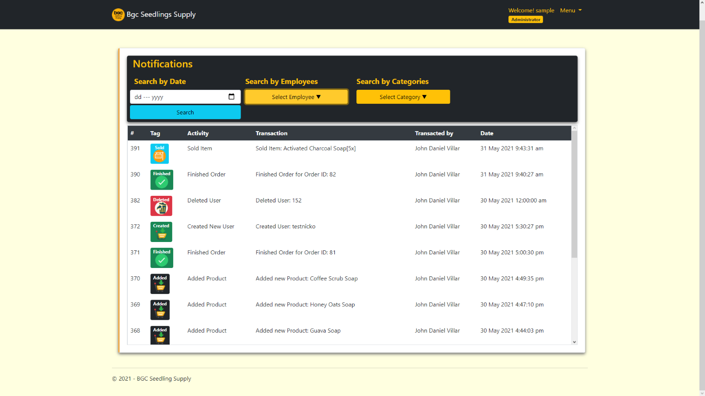
   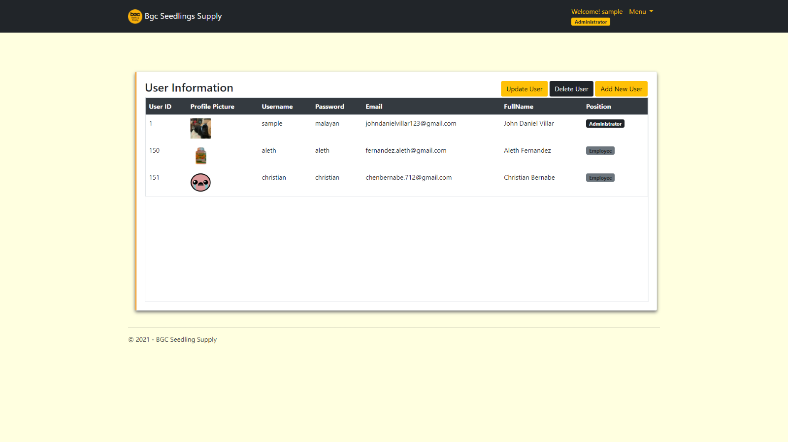   
 </tr>
</table>
  

   
